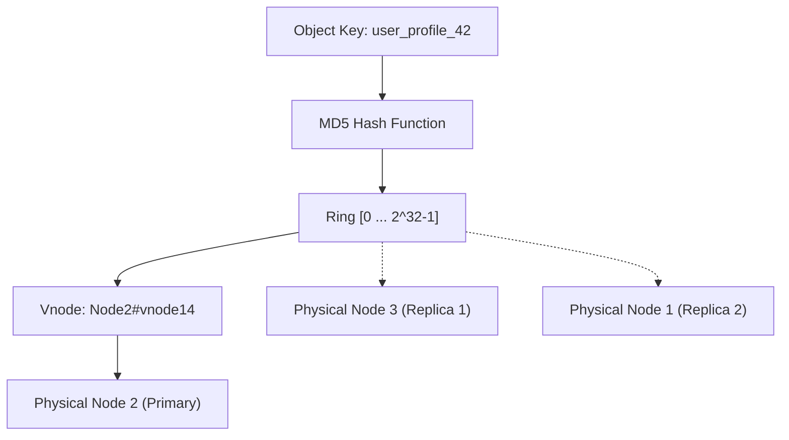

# Consistent Hashing Ring with Virtual Nodes Skill

High-performance, zero-dependency Python implementation of **Consistent Hashing with Virtual Nodes (Vnodes)** for distributed caching, partition management, and replica distribution.

## Features
- **Virtual Nodes Distribution**: Uniform key allocation avoiding hot spots using \(O(K)\) vnodes per physical node.
- **Dynamic Membership**: Fast \(O(\log(VN))\) key routing via binary search over sorted integer ring.
- **Zero External Dependencies**: Pure Python standard library (`hashlib`, `bisect`).
- **Native MCP Protocol**: JSON-RPC 2.0 stdio server compatible with Claude Desktop, Cursor, and Windsurf.

## Architecture

